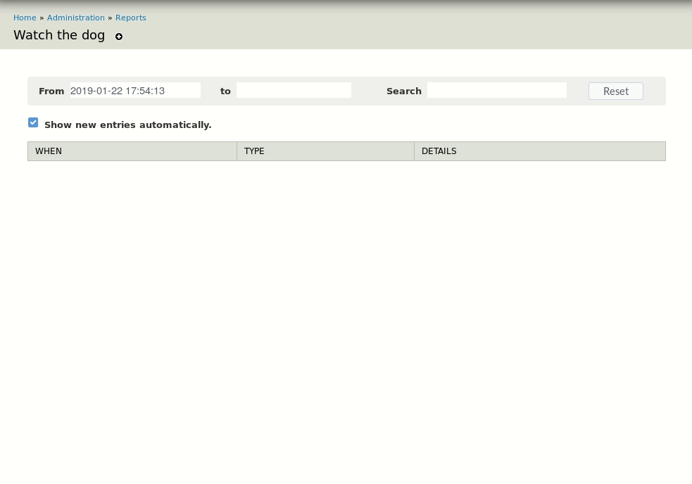

# Watch The Dog

Install this Drupal 7 module then head over to /admin/reports/wtd

Features

- Shows full message without having to load the full watchdog entry page.

- Compact (by default) and colourful.

- Inspect variables - they are shown as JSON for legibility.

- To-the-second timestamp

- 'Since' to only show watchdog items that come in from that point on.

- Auto-update: option to immediately display them, otherwise notification comes
  when there is new content.

- Search (variables and message)

- Click a row to select it - just changes it's background, but useful to keep
  track of certain messages while debugging.
